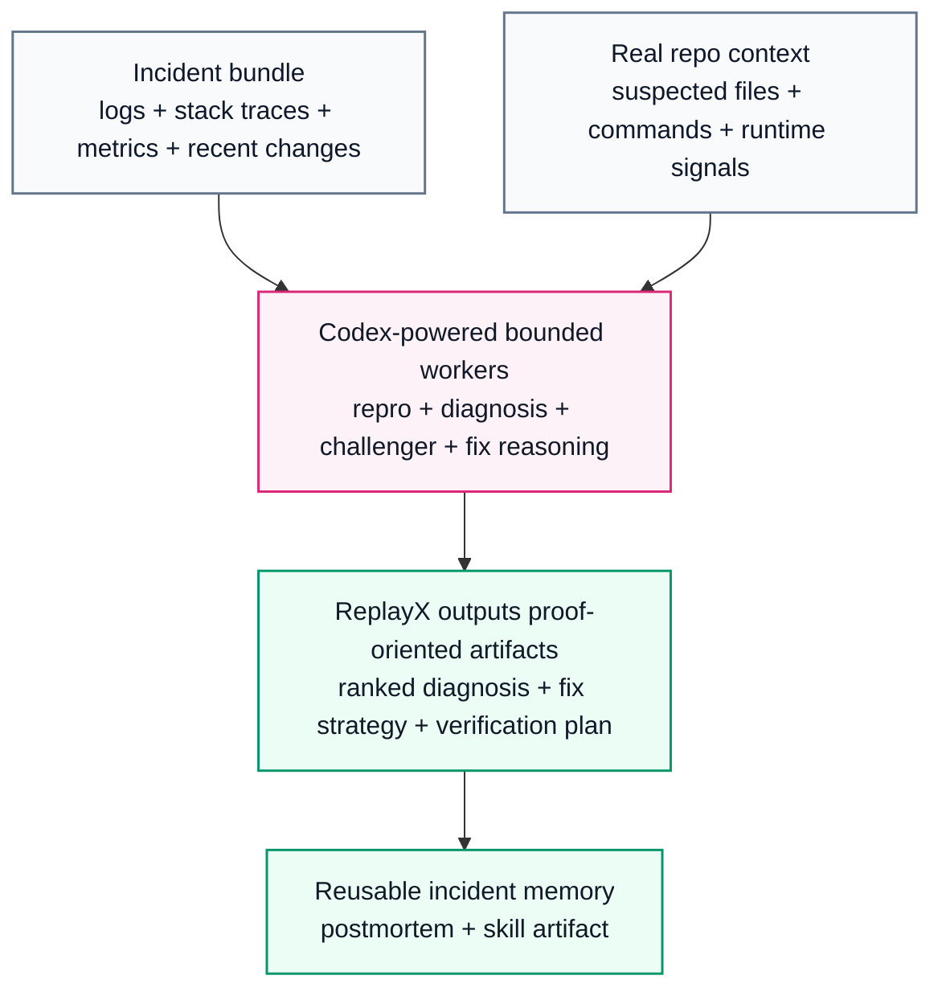

# ReplayX Architecture Diagram

This is the judge-friendly architecture view of ReplayX.

It is intentionally optimized for fast understanding:

- bug appears
- intake starts
- Codex specialists reason in bounded phases
- artifacts are written
- the dashboard shows proof, not just claims

## High-Level System

```mermaid
flowchart LR
    classDef trigger fill:#E8F1FF,stroke:#3B82F6,color:#0F172A,stroke-width:1.5px;
    classDef app fill:#FEF3C7,stroke:#D97706,color:#111827,stroke-width:1.5px;
    classDef core fill:#ECFCCB,stroke:#65A30D,color:#111827,stroke-width:1.5px;
    classDef codex fill:#FCE7F3,stroke:#DB2777,color:#111827,stroke-width:1.5px;
    classDef data fill:#F3F4F6,stroke:#6B7280,color:#111827,stroke-width:1.5px;
    classDef output fill:#DCFCE7,stroke:#16A34A,color:#111827,stroke-width:1.5px;

    DemoApp["Broken Demo App<br/>Seeded reproducible incidents"]:::app
    Slack["Slack Intake<br/>Bug report trigger"]:::trigger

    subgraph ReplayX["ReplayX Product Surface"]
        Dashboard["ReplayX Dashboard<br/>Judge-facing replay + live run view"]:::output

        subgraph ControlPlane["ReplayX Orchestrator"]
            Intake["1. Incident Intake<br/>Normalize bundle"]:::core
            SkillMatch["2. Skill Match<br/>Check reusable incident memory"]:::core
            Repro["3. Repro<br/>Confirm failure surface"]:::core
            Diagnosis["4. Diagnosis Arena<br/>Parallel specialist workers"]:::codex
            Challenger["5. Challenger<br/>Disprove weak diagnoses"]:::codex
            FixArena["6. Fix Arena<br/>Rank minimal / safe / durable fixes"]:::codex
            Review["7. Review & Regression<br/>Define proof required"]:::core
            Postmortem["8. Postmortem & Skill Writer<br/>Emit reusable knowledge"]:::core
        end

        subgraph Evidence["Replay-Safe Artifact Layer"]
            Incidents["incidents/<br/>seeded incident bundles"]:::data
            Artifacts["artifacts/<br/>phase JSON, logs, replay data"]:::data
            Skills["skills/<br/>reusable incident skills"]:::data
        end
    end

    DemoApp -->|"user-visible failure"| Slack
    Slack -->|"incident text + context"| Intake
    Incidents --> Intake
    Intake --> SkillMatch --> Repro --> Diagnosis --> Challenger --> FixArena --> Review --> Postmortem

    Repro -->|"repo context + failing commands"| Diagnosis
    Diagnosis -->|"ranked hypotheses"| Challenger
    Challenger -->|"winning root cause"| FixArena
    FixArena -->|"best fix strategy"| Review
    Review -->|"approved proof plan"| Postmortem

    Intake --> Artifacts
    SkillMatch --> Artifacts
    Repro --> Artifacts
    Diagnosis --> Artifacts
    Challenger --> Artifacts
    FixArena --> Artifacts
    Review --> Artifacts
    Postmortem --> Artifacts
    Postmortem --> Skills

    Artifacts --> Dashboard
    Skills --> Dashboard
    Slack -->|"handoff link"| Dashboard
```

## Why Codex Matters

## Reading Guide

- `demo_app/` is the broken target system.
- `slack/` is the intake trigger, not the main product.
- `orchestrator/` is the Codex-first reasoning pipeline.
- `artifacts/` makes every run inspectable and replayable.
- `dashboard/` is the main judge-facing surface.
- `skills/` is how ReplayX turns one solved incident into future leverage.

## One-Sentence Summary

ReplayX turns incident response from an opaque debugging scramble into a Codex-powered, replayable engineering workflow with proof and reusable memory.
