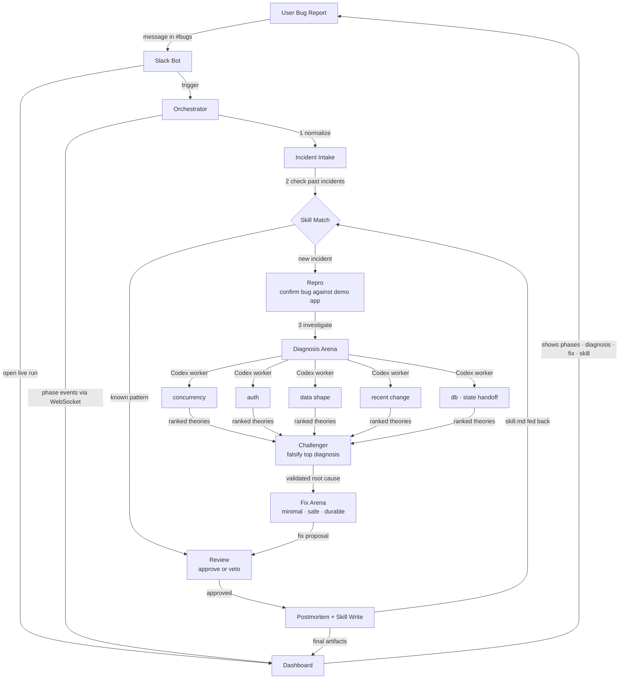

# ReplayX — How It Works

> Drop a bug report. Get a diagnosis, a fix, a postmortem, and a reusable skill — automatically.

## Walkthrough

| # | What happens |
|---|-------------|
| 1 | User reports a bug in Slack. Bot triggers the Orchestrator **and** immediately opens a live run on the Dashboard |
| 2 | Orchestrator streams every phase event to the Dashboard over WebSocket in real time |
| 3 | **Intake** normalizes the report into a clean bundle — title, error, logs, repo, recent changes |
| 4 | **Skill Match** checks if this pattern was seen before. Hit → skip straight to Review |
| 5 | **Repro** runs the failing command against the demo app to confirm the bug is real |
| 6 | **Diagnosis Arena** fans out to parallel Codex workers, each owning a failure domain |
| 7 | **Challenger** tries to falsify the top theory — weak diagnoses are rejected here |
| 8 | **Fix Arena** ranks strategies by blast radius: minimal patch → safe refactor → durable redesign |
| 9 | **Review** approves or vetoes the proposal |
| 10 | **Postmortem + Skill Write** saves `skill.md` back into Skill Match for future incidents — and pushes everything to the Dashboard |
