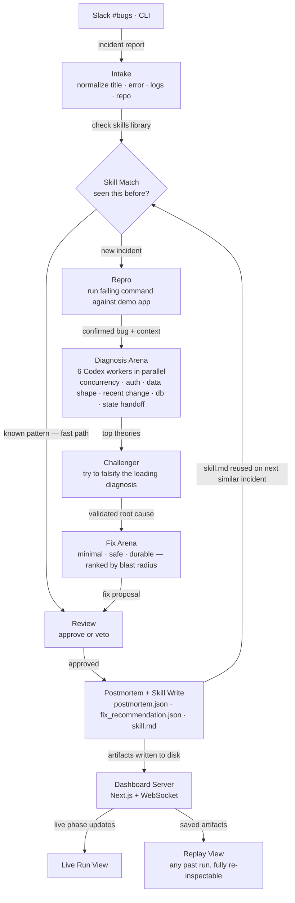

# ReplayX — How It Works

> Drop a bug report. Get a diagnosis, a fix, a postmortem, and a reusable skill — automatically.

## Walkthrough

| # | Phase | What happens |
|---|-------|-------------|
| 1 | **Intake** | Normalizes the report — title, error, logs, repo, recent changes — into a clean bundle |
| 2 | **Skill Match** | Checks if this pattern was seen before. Match → skip straight to Postmortem |
| 3 | **Repro** | Runs the failing command against the demo app to confirm the bug before spending compute |
| 4 | **Diagnosis Arena** | 6 Codex workers run in parallel, each owning a failure domain |
| 5 | **Challenger** | A dedicated worker tries to falsify the top theory. Weak diagnoses get rejected here |
| 6 | **Fix Arena** | Fix strategies ranked by blast radius: minimal patch → safe refactor → durable redesign |
| 7 | **Review** | Final worker approves or vetoes the fix proposal |
| 8 | **Postmortem + Skill** | Writes a postmortem and a `skill.md` that feeds back into Skill Match for future runs |
| — | **Dashboard** | Every phase streams live over WebSocket. Any past run is replayable from saved artifacts |
